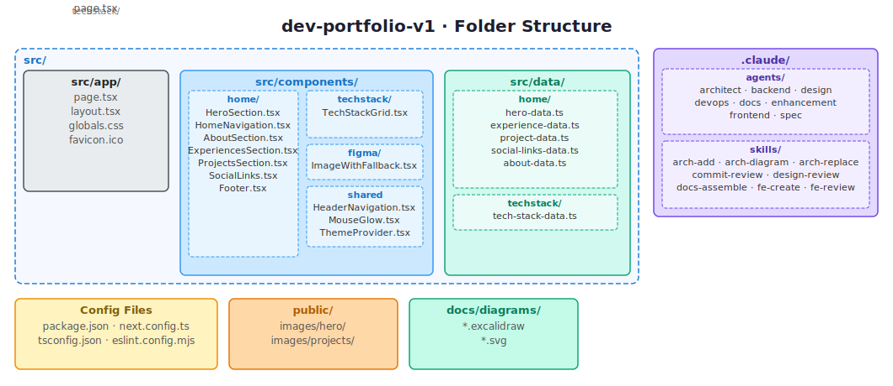
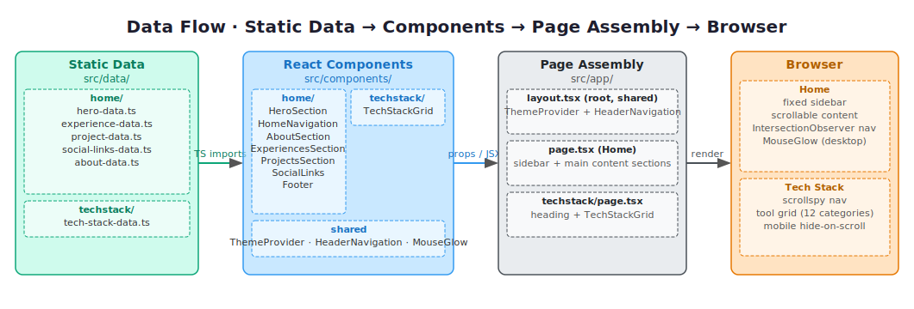
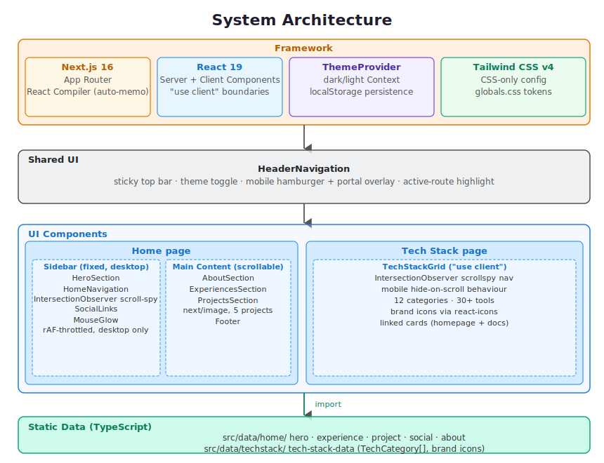

# dev-portfolio-v1

Personal developer portfolio built with Next.js 16, React 19, TypeScript, and Tailwind CSS v4.

[Live site](https://yourname.dev) · [Architecture](docs/diagrams/architecture.svg)

## Overview

Single-page portfolio with a fixed left sidebar (hero, navigation, social links) and a scrollable right content area. Dark/light mode is detected from `prefers-color-scheme` on first visit and persisted to `localStorage`. All content is static TypeScript — no server, no CMS, no database.

**Stack:** Next.js 16 · React 19 · TypeScript · Tailwind CSS v4 · Lucide Icons · React Icons

## Getting Started

```bash
bun install   # install dependencies
bun dev       # start development server
```

Open [http://localhost:3000](http://localhost:3000) in your browser.

| Command         | Description                              |
| --------------- | ---------------------------------------- |
| `bun dev`       | Start the development server             |
| `bun build`     | Build the app for production             |
| `bun start`     | Start the production server after build  |
| `bun lint`      | Run ESLint across the codebase           |
| `bun typecheck` | Type-check without emitting output files |

## Architecture

A single-page Next.js 16 app using the App Router, composed in three layers: the app entry point (`src/app`) orchestrates layout and theme state, UI components (`src/components`) render each section in isolation, and a static data layer (`src/data`) owns all content as typed TypeScript modules.

### Folder Structure



### Data Flow



### System Architecture



## Data Contracts & Schemas

All content is static TypeScript defined in `src/data/`. There is no runtime data fetching, no CMS, and no database — schemas are compile-time only and tree-shaken into the production bundle.

| File                   | Exported type(s) | Description                                                                                             |
| ---------------------- | ---------------- | ------------------------------------------------------------------------------------------------------- |
| `hero-data.ts`         | `HeroData`       | Name, title, bio, and optional avatar path for the hero section                                         |
| `experience-data.ts`   | `Experience[]`   | Work history cards with period, role, company, optional location, URL, description, and tech stack      |
| `project-data.ts`      | `Project[]`      | Portfolio project cards with title, description, image path, stack, live URL, and optional GitHub stats |
| `social-links-data.ts` | `Social[]`       | Sidebar and footer links — each entry holds a `react-icons` `IconType`, href, and accessible label      |
| `about-data.ts`        | `AboutData`      | About section copy with optional avatar, summary prose, and an optional resume link                     |

Import via the `@/data/*` path alias (resolves to `./src/data/`):

```ts
import { heroData } from "@/data/hero-data";
import { projectData } from "@/data/project-data";
```

**Conventions:** Optional fields (`?`) are used only where the value is genuinely absent in real data. Arrays are not currently marked `readonly` at the export site — adding `as const` or `readonly` is recommended to prevent accidental mutation.

## Design System

Theme tokens are defined as CSS custom properties in `src/app/globals.css` and surfaced to Tailwind via `@theme inline`, which maps each token to a utility class (e.g. `bg-background`, `text-foreground`, `text-accent`).

**Dark mode is the default** (`:root`). Light mode is activated by setting `data-theme="light"` on the `<html>` element. On first visit the theme is read from `prefers-color-scheme` and then persisted to `localStorage`.

Theme switches transition smoothly via:

```css
transition:
  background-color 0.2s ease,
  color 0.2s ease;
```

### Token reference

| Token          | Dark (default) | Light (`data-theme="light"`) |
| -------------- | -------------- | ---------------------------- |
| `--background` | `#1e1e2e`      | `#f8fafc`                    |
| `--foreground` | `#a6adc8`      | `#3f4b5c`                    |
| `--heading`    | `#e2e8f0`      | `#0f172a`                    |
| `--accent`     | `#54d8b9`      | `#0f766e`                    |
| `--surface`    | `#313244`      | `#e2e8f0`                    |

Additional tokens (`--accent-rgb`, `--glow-rgb`, `--glow-opacity`, `--glow-size`, `--glow-fade`) support the `MouseGlow` ambient cursor effect and are defined per theme in `globals.css`.

## Environment Variables

No environment variables are required to run this project locally.

If environment variables are added in future (for example, to support a contact form or external API), they should be:

1. Added to a `.env.example` file at the project root (committed, with values redacted)
2. Configured in Vercel under **Project Settings → Environment Variables**

## Deployment & CI/CD

Deployed on [Vercel](https://vercel.com). Merging to `main` triggers a production deployment automatically via Vercel's GitHub integration.

[](https://vercel.com/new/clone?repository-url=https://github.com/YOUR_USERNAME/dev-portfolio-v1)

Preview deployments are created automatically for every pull request — each PR gets its own isolated URL for review before merging to production.

### CI checks (GitHub Actions)

> **Note:** No CI workflow is configured yet. The workflow below is the recommended starting point — add it at `.github/workflows/ci.yml` to gate merges on passing checks.

```yaml
name: CI

on:
  push:
    branches: [main]
  pull_request:

jobs:
  quality:
    runs-on: ubuntu-latest
    steps:
      - uses: actions/checkout@v4
      - uses: oven-sh/setup-bun@v2
      - name: Install dependencies
        run: bun install --frozen-lockfile
      - name: Lint
        run: bun lint
      - name: Type-check
        run: bun typecheck
      - name: Build
        run: bun build
```

This workflow runs on every push and PR: **install** → **lint** → **typecheck** → **build**. The `--frozen-lockfile` flag ensures the lockfile is never silently updated in CI.

## Roadmap

### In progress

- [ ] CV download button in the hero section (one-click PDF; recruiter-critical above the fold)
- [ ] Project archive page to showcase for all past projects
- [ ] Technical Stack and workflow list to showcase agentic AI workflows
- [ ] Heroes, Inspiration List (GitHub contributors and their projects with a one liner description for inspiration list)
- [ ] Open to work status indicator driven by a data file (toggle availability without a code change)

### Planned

- [ ] SEO metadata — personalised `<title>`, Open Graph tags, Twitter Card, and a branded OG image
- [ ] Contact form — Server Actions + Resend, lower friction than a bare email link
- [ ] Scroll-reveal entrance animations — subtle `opacity` + `translateY` respecting `prefers-reduced-motion`
- [ ] `Person` JSON-LD structured data for Google search presence
- [ ] `sitemap.xml` and `robots.txt` to ensure full indexing
- [ ] Custom domain — a Vercel subdomain signals an unfinished project to hiring managers

### Stretch goals

- [ ] Blog / technical writing section — 2–3 articles demonstrate communication depth beyond a badge list
- [ ] Project detail pages with full case studies (problem, role, technical decisions, outcomes)
- [ ] Command palette (`⌘K`) — keyboard-driven navigation that senior engineers notice
- [ ] Lighthouse CI in GitHub Actions — automate Core Web Vitals regression checks on every push
- [ ] Filtered project list — filter by language or domain
